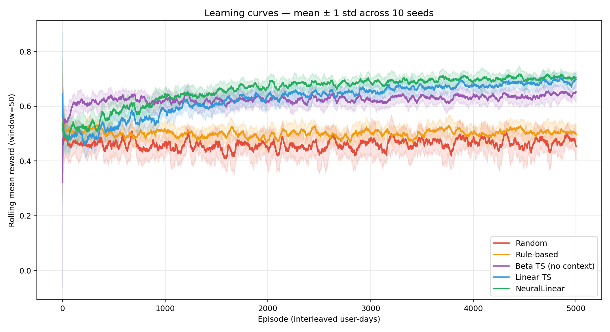
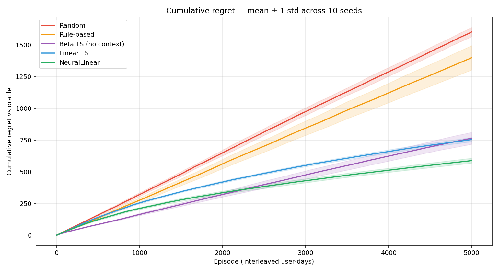
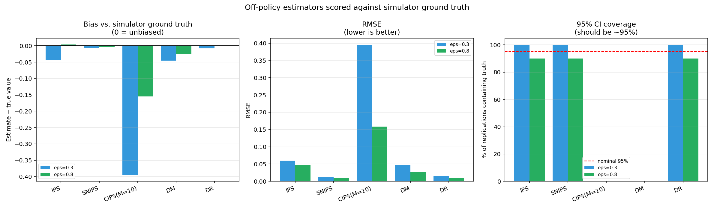

# ProFit AI — Safety-Constrained Contextual Bandits for Training Prescription

> NeuralLinear Thompson Sampling (PyTorch) · Off-policy evaluation with ground-truth calibration · Shared feature transform · FastAPI + Redis + Kafka + PySpark

[](https://github.com/zhengbrody/RL/actions)
[](https://www.python.org/)
[](LICENSE)

A daily training recommender: given today's physiological state, choose one of
18 workout prescriptions, learn from what the user actually does, and never
propose something unsafe.

---

## Results

**Online benchmark** — 10 seeds × 5,000 episodes × 100 interleaved users. Mean ± std across seeds.

| Policy | Mean reward | Cumulative regret | Final regret rate | Rank AUC | Actions used |
|--------|------------:|------------------:|------------------:|---------:|-------------:|
| Random | 0.4604 ± 0.0069 | 1602.7 ± 38.7 | 0.3151 | 0.500 | 18/18 |
| Rule-based baseline | 0.5013 ± 0.0183 | 1399.1 ± 101.1 | 0.2772 | 0.480 | **3/18** |
| Beta TS *(no context)* | 0.6260 ± 0.0098 | 764.5 ± 49.5 | 0.1409 | 0.668 | 18/18 |
| Linear TS | 0.6279 ± 0.0047 | 754.0 ± 18.1 | 0.0944 | 0.782 | 18/18 |
| **NeuralLinear (PyTorch)** | **0.6605 ± 0.0035** | **588.1 ± 21.0** | **0.0757** | 0.778 | 18/18 |

Versus the rule-based baseline, NeuralLinear delivers **+31.9% ± 4.8% mean reward**,
**−57.8% ± 2.5% cumulative regret**, and **−72.7% final regret rate**.

Reproduce: `python scripts/benchmark_multi_seed.py --num_seeds 10 --episodes 5000`

### The two comparisons that matter

The three bandit rows share the same posterior machinery
([`bayes_linear.py`](src/recommendation/bayes_linear.py)), the same exploration
mechanism, and the same safety gate. They differ only in what they condition on,
which makes the table an ablation rather than a collection of unrelated models.

**Does context help?** Beta TS → Linear TS. Mean reward barely moves (0.6260 →
0.6279) but the *final* regret rate drops 33% (0.1409 → 0.0944) and rank AUC
jumps 0.668 → 0.782. Splitting a run into quintiles shows why. After its first
1,000 episodes the context-free bandit is done learning — it gains just **+0.009
reward** over the remaining 4,000 episodes — because it has learned which actions
are good *on average* and has no mechanism to learn which are good *for this user
today*. Over the same span Linear TS gains **+0.071**, eight times as much, and is
still climbing at the end of the run.

**Does learning the representation help?** Linear TS → NeuralLinear. Mean reward
+5.2%, cumulative regret −22%. The reward's dominant term is a squared penalty on
the gap between prescribed and ideal intensity, and that ideal is a nonlinear
function of readiness, fatigue and accumulated load — so a model that is linear
in the raw features cannot represent it, however good its posterior is.

**Action coverage.** The deterministic rule set emits only **3 of 18** actions
across 5,000 episodes. The other 15 are unreachable by construction, no matter
how well they would have performed. That is the concrete cost of not exploring.

<details>
<summary>Learning and regret curves</summary>




</details>

---

## Off-policy evaluation, validated against ground truth

You cannot ship an unproven recommender to users to find out whether it is
better. You estimate its value from logs the current policy already produced —
and then you have to decide which estimator to believe, because on real data the
true value is exactly the unknown you were estimating.

Here it is knowable. The simulator exposes the noise-free expected reward of
every action, so the target policy's true value on the logged context
distribution is computable in closed form. That turns estimator choice from an
argument into a measurement.

**10 replications × 4,000-row logs**, target = trained NeuralLinear, behaviour =
ε-greedy over the rule baseline:

| Estimator | Bias | RMSE | 95% CI coverage | Effective sample size |
|-----------|-----:|-----:|----------------:|----------------------:|
| IPS | +0.0037 | 0.0478 | 90% | 8.5% |
| SNIPS | −0.0035 | 0.0103 | 90% | 8.5% |
| CIPS (M=10) | −0.1553 | 0.1587 | **0%** | 8.5% |
| Direct Method | −0.0264 | 0.0272 | **0%** | n/a |
| **Doubly Robust** | **−0.0017** | **0.0103** | 90% | 8.5% |

*(logging policy ε=0.8; the ε=0.3 arm, where effective sample size collapses to
3%, is in [`scripts/ope_study_results.json`](scripts/ope_study_results.json))*

- **DR estimates the true policy value to within 0.24%**, and its RMSE is
  **4.7× lower than IPS**.
- Translated into the decision an operator actually makes: the true lift over the
  logging policy was **+43.7%**; DR's off-policy estimate implied **+43.4%** —
  **0.36 percentage points off**, without touching a user.
- **The Direct Method's 95% interval never contained the truth**, across all 20
  runs. It is the lowest-variance estimator in the table and it is confidently
  wrong — which is why variance alone is a bad way to pick one.
- Effective sample size is **8.5%**: a 4,000-row log carries the information of
  ~340 rows for this target. Reporting that alongside the estimate is the
  difference between a defensible number and a precise-looking one.



Reproduce: `python scripts/run_ope_study.py --replications 10 --log-size 4000`

---

## Why contextual bandits

No labelled dataset of "correct workouts" exists. Feedback is implicit
(completion, satisfaction), arrives only for the action taken, and arrives after
the fact. That is a bandit problem, not a supervised one.

| Decision | Choice | Reason |
|----------|--------|--------|
| Algorithm | NeuralLinear Thompson Sampling | Learned representation for the nonlinearity, **exact** last-layer posterior for calibrated exploration |
| Exploration | Posterior sampling | No separate exploration parameter to tune; uncertainty comes from the model |
| Safety | Hard gate *before* sampling | Exploration is confined to the feasible set — the policy cannot override physiology |
| Action space | 18 discrete (type × intensity × duration) | Clinically meaningful granularity |
| Online updates | Posteriors only; encoder frozen | Closed-form and cheap; representation retrained offline where full history exists |

**Why not a fully Bayesian neural network?** Its posterior is approximate, and
the approximation error is worst in the tails — exactly what drives exploration.
Under-dispersed posteriors make Thompson Sampling collapse to greedy.
NeuralLinear ([Riquelme et al., ICLR 2018](https://arxiv.org/abs/1802.09127))
learns the representation by ordinary SGD and keeps the last layer conjugate, so
the uncertainty that governs exploration stays exact.

---

## Architecture

```
                    ┌──────────────────────────────────────┐
  wearable /        │  Shared feature transform (34 feats) │
  manual signals ──▶│  src/feature_store/transform.py      │◀── rolling block
                    └───────────────┬──────────────────────┘    (Redis cache)
                                    │
                    ┌───────────────▼──────────────────────┐
                    │  Safety gate — hard rules            │
                    │  src/safety/action_filter.py         │
                    │  18 actions ──▶ feasible subset      │
                    └───────────────┬──────────────────────┘
                                    │
                    ┌───────────────▼──────────────────────┐
                    │  NeuralLinear Thompson Sampling      │
                    │  MLP(64,32) ▶ 32-d repr ▶ NIG per arm│
                    └───────────────┬──────────────────────┘
                                    │
              ┌─────────────────────┴───────────────────────┐
              │                                             │
    ┌─────────▼──────────┐                    ┌─────────────▼────────────┐
    │ FastAPI serving    │                    │ Kafka feedback stream    │
    │ p99 4.4 ms         │                    │ loop closes in 7.3 ms    │
    └────────────────────┘                    └─────────────┬────────────┘
                                                            │
                    ┌───────────────────────────────────────▼──────────┐
                    │ Posterior update (closed form) ▶ next request     │
                    └──────────────────────────────────────────────────┘

   Offline: PySpark materialises the rolling block for every user-day
            src/feature_store/spark_pipeline.py
```

### One transform, one gate, no second copies

Training–serving skew rarely arrives as someone deliberately rewriting feature
logic. It arrives as a "small" convenience in the serving path — a different
default for a missing field, a re-ordered column list — that nothing checks.

This repo previously had two instances of exactly that: the benchmark carried a
private copy of the safety filter that omitted the consecutive-hard-days rule (so
the policy was *measured* under weaker constraints than it *ran* under), and the
feature vector was assembled independently on each path.

Now the transform lives in one module and the gate in another, both imported by
the benchmark, the API and the Kafka consumer — and
[`tests/test_feature_parity.py`](tests/test_feature_parity.py) fails if the paths
ever disagree:

- offline vs. online assembly of the same record → **bit-identical vectors**
- warm cache vs. cold cache → bit-identical
- Redis unreachable, or a corrupt cache entry → identical output, slower
- benchmark gate vs. serving gate → identical allowed sets
- missing fields **fail closed** (a recommender that gets bolder the less it knows is dangerous)

The rolling block is computed twice by design — pandas per request, PySpark for
the nightly materialisation — so
[`tests/test_spark_pipeline.py`](tests/test_spark_pipeline.py) runs both over the
same history and asserts agreement to 1e-9 on every field, including the
partial-window regime early in a user's history.

---

## Serving

Real HTTP against uvicorn on loopback, 2,000 requests per arm:

| Arm | p50 | p95 | p99 | Throughput |
|-----|----:|----:|----:|-----------:|
| `GET /health` (transport floor) | 0.31 ms | 0.42 ms | 0.61 ms | — |
| `POST /recommend_rl` — cache miss | 3.89 ms | 5.50 ms | 7.21 ms | — |
| `POST /recommend_rl` — cache hit | 2.37 ms | 3.35 ms | **4.41 ms** | — |
| `POST /recommend_rl` — 16 concurrent | 31.4 ms | 36.0 ms | 39.0 ms | **509 req/s** |
| Compute only (no HTTP) | 1.59 ms | 2.20 ms | 2.74 ms | — |

The Redis feature cache cuts p99 from 7.21 ms to 4.41 ms (**1.6×**); transport
accounts for 0.78 ms of the 2.37 ms p50.

> An earlier version of this benchmark used FastAPI's in-process `TestClient` and
> reported sub-millisecond p99. That number was real but answered the wrong
> question — it excludes the event loop, the socket and JSON-over-the-wire, which
> is most of what a client waits for. Both are now measured, and the gap between
> them is reported rather than hidden.

Reproduce: `python scripts/benchmark_latency.py --n 2000`

### Kafka online-learning loop

2,000 events through a real broker, paced at 200 events/s:

| Metric | Value |
|--------|------:|
| Events produced → consumed → **posterior updates applied** | 2000 → 2000 → **2000** |
| Producer/consumer feature mismatches | **0** |
| Loop latency (publish → model updated) | p50 **7.3 ms**, p95 9.5 ms, p99 16.7 ms |

Both checks are assertions, not observations. "Kafka-based online learning" fails
silently in two ways: the loop is plumbed but never closes (events flow, nothing
reaches the model), or it closes but the consumer rebuilds features that do not
match what the recommendation was made from. So the script requires posterior
counts to rise by exactly the number of consumed events, and re-derives features
through the shared transform to compare against the decision-time vector.

**This test found a real bug.** The first run reported *−18,000* posterior
updates: loading a checkpoint restores the posteriors but not the replay buffer,
so the first online encoder retrain rebuilt the posteriors from an empty buffer
and discarded everything the model had learned. The fix is architectural —
serving freezes the encoder and updates only the last-layer posteriors, which is
the right split anyway ([`neural_linear.py`](src/recommendation/neural_linear.py)).

Reproduce: `python scripts/run_kafka_loop.py --events 2000 --rate 200`

---

## The simulator

Every number above comes from simulation. What the simulator does and does not
model determines what those numbers are worth, so:

**It models** heterogeneous users (each draws a latent tolerance, modality
affinity and duration preference), partial observability (stated tolerance
correlates with the latent value at r = 0.76 but never reveals it), non-stationarity
(fitness adapts to load, with detraining deliberately slower than adaptation),
and stochastic adherence.

**It does not model** real physiology, real users, or anything validated against
clinical outcomes. The reward function is a designed objective, not a measured
one.

An earlier version scored policies against a deterministic function of two
observable variables. That is degenerate — the optimal policy is a lookup table,
there is nothing to personalise, and a context-free bandit does about as well as
a contextual one — so any "RL beats rules" number measured there says very
little. The current version was rebuilt specifically so that the comparisons
above are not artefacts of the environment.

[`tests/test_simulation_and_runner.py`](tests/test_simulation_and_runner.py) pins
the properties the conclusions rest on: reproducibility, bounded rewards,
heterogeneity, incomplete observability, and the adaptation asymmetry.

---

## Quick start

```bash
pip install -r requirements.txt
```

Reproduce the headline benchmark (no services needed):

```bash
python scripts/benchmark_multi_seed.py --num_seeds 10 --episodes 5000
```

Train and serve the policy:

```bash
python scripts/train_policy.py --episodes 20000 --users 200
docker-compose up -d redis
uvicorn src.serving.api_server:app --port 8000
```

```bash
curl -X POST localhost:8000/recommend_rl -H 'Content-Type: application/json' -d '{"user_id":"u1","signals":{"readiness_score":72,"hrv":55,"sleep_duration_hours":7.4,"fatigue":3,"goal":"strength"}}'
```

Full stack (Redis + Kafka + API + UI):

```bash
docker-compose up
```

---

## Project structure

```
src/
├── feature_store/
│   ├── transform.py          # THE shared feature transform (34 features)
│   └── spark_pipeline.py     # PySpark offline materialisation
├── safety/
│   └── action_filter.py      # THE safety gate (pure, fail-closed)
├── recommendation/
│   ├── bayes_linear.py       # NIG posteriors, shared by both bandits
│   ├── neural_linear.py      # PyTorch NeuralLinear Thompson Sampling
│   ├── linear_ts.py          # Linear TS — the representation ablation
│   └── contextual_bandits.py # Beta-Bernoulli TS — the context-free control
├── simulation/
│   └── fitness_env.py        # Heterogeneous, non-stationary population
├── evaluation/
│   ├── ope.py                # IPS / SNIPS / CIPS / DM / DR + diagnostics
│   ├── policies.py           # Uniform policy interface with propensities
│   └── runner.py             # Benchmark loop + logged-data collection
├── serving/
│   ├── feature_service.py    # Redis-cached feature assembly
│   ├── policy_service.py     # Checkpoint loading + inference
│   └── api_server.py         # FastAPI
└── agent/                    # GPT-4 coaching layer (explanation, memory)

scripts/
├── benchmark.py              # Single-seed benchmark
├── benchmark_multi_seed.py   # 10-seed aggregation → README numbers
├── run_ope_study.py          # Estimator calibration vs ground truth
├── benchmark_latency.py      # Real-HTTP latency + throughput
├── run_kafka_loop.py         # Closed-loop verification
└── train_policy.py           # Train + persist the serving checkpoint
```

---

## Tests

**244 tests.** Core modules: `fitness_env` 100%, `spark_pipeline` 97%,
`linear_ts` 96%, `ope` 94%, `bayes_linear` 94%, `runner` 93%, `transform` 91%,
`action_filter` 91%, `feature_service` 90%, `neural_linear` 89%.

```bash
pytest tests/ -q --cov=src
```

The tests worth reading are the ones that pin properties rather than outputs:
Doubly Robust staying accurate under a deliberately broken reward model, the
posterior rebuild after an encoder retrain, cold/warm cache bit-parity, and the
safety gate failing closed on missing fields.

---

## Honest limitations

| Claim | Reality |
|-------|---------|
| All reported metrics | Simulated population. No real users, no clinical validation. |
| Off-policy evaluation | Correct estimators, validated against simulator ground truth — which is exactly the validation that is *impossible* on real logs. |
| Reward function | A designed objective. Whether it correlates with real training outcomes is untested. |
| Latency / throughput | Single uvicorn worker on a laptop, loopback socket. No production load profile. |
| PySpark pipeline | Correct and parity-tested, but run at a scale pandas would handle. It is the right shape, not a demonstration of scale. |
| iOS integration | Data-collection code written; no deployed app. |
| GPT-4 coach | Functional explanation layer; not part of the recommendation policy. |

---

## Future work

- Off-policy *learning* (not just evaluation): train directly on logged data with DR objectives
- Delayed and censored rewards — adherence is observed days later
- Non-stationary posteriors (discounted or sliding-window) for drifting preferences
- Contextual safety: learn the constraint boundary instead of hand-coding it
- Real deployment with a shadow-mode A/B against the rule baseline

---

## License

MIT — see [LICENSE](LICENSE). Not a medical device; the recommendations here are
not clinical advice.

---

## Contact

**Author**: zheng dong · [LinkedIn](https://www.linkedin.com/in/zhengdong17/) · zhengdong0317@gmail.com

⭐ Star if useful · Issues welcome · PRs open
