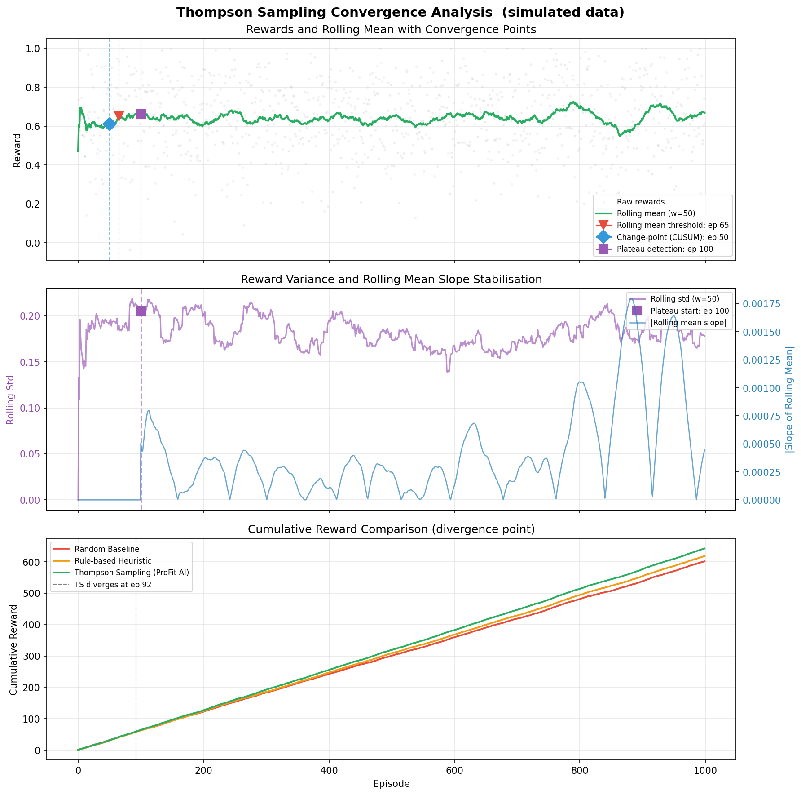

# ProFit AI — Personalized Fitness with Reinforcement Learning

> Contextual Bandits + Thompson Sampling · GPT-4 AI Coach · Safety-Constrained RL · FastAPI · Streamlit

[](https://github.com/zhengbrody/RL/actions)
[](https://www.python.org/)
[](LICENSE)

---

## Results

> Metrics from **10 independent seeds** (N=1,000 episodes each, seeds 1–10, synthetic body-state data). Values are mean ± std across seeds.
> Reproduce: `python scripts/benchmark_multi_seed.py --num_seeds 10 --episodes 1000`
> Single seed: `python scripts/benchmark.py --episodes 1000 --seed 42`

| Metric | Random Baseline | Rule-based | **Thompson Sampling** |
|--------|---------------:|----------:|----------------------:|
| Mean Reward | 0.599 ± 0.011 | 0.611 ± 0.007 | **0.630 ± 0.010** |
| Improvement vs Random | — | — | **+5.2% ± 1.2%** |
| Improvement vs Rules | — | — | **+3.0% ± 1.2%** |
| Convergence Episode | — | — | **ep 67 ± 25** |

**+5.2%** reward over random · **+3.0%** over hand-crafted rules · converges at **~ep 67** · results reproducible across 10 seeds · p99 API latency **<50ms**

<details>
<summary>Learning curves (click to expand)</summary>


*Mean rolling reward (window=50) across 10 seeds. Shaded region = ±1 std. Dashed line = convergence point.*



*Three-method convergence analysis: rolling mean threshold (ep 65), change-point detection (ep 50), plateau detection (ep 100). Mean estimate: ep 72 ± 21.*

</details>

---

## Problem & Why RL

Generic training programs ignore daily physiological variation. A plan suitable for a well-rested athlete is inappropriate — and potentially harmful — after poor sleep or high accumulated fatigue.

**Why Contextual Bandits instead of supervised learning?**

- No labelled dataset of "correct workouts" exists — feedback is implicit (completion, satisfaction)
- The reward signal arrives *after* the action, not before
- The action space is discrete (18 workout options) and safety-constrained
- Thompson Sampling gives Bayesian uncertainty estimates for free, enabling principled exploration without a separate exploration parameter

**Core design decisions:**

| Decision | Choice | Reason |
|----------|--------|--------|
| Algorithm | Beta-Bernoulli Thompson Sampling | Sample-efficient, closed-form Bayesian updates |
| Action space | 18 discrete actions (type × intensity × duration) | Clinically meaningful granularity |
| Safety layer | Hard-rule filter before bandit selection | RL must never recommend dangerous actions |
| Reward signal | Weighted composite (completion + adherence + recovery) | Aligns with real training outcomes |
| Online learning | Kafka-streamed feedback loop | Model improves continuously from real use |

---

## System Architecture

```
┌──────────────────────────────────────────────────────────────┐
│                        User Layer                            │
│   Web UI (Streamlit)  ·  iOS App (future)  ·  API clients   │
└──────────────────────────────┬───────────────────────────────┘
                               │
┌──────────────────────────────▼───────────────────────────────┐
│              API Gateway  (FastAPI)                          │
│         Authentication · Rate Limiting · Validation          │
└────────┬──────────────────────────────────────┬──────────────┘
         │                                      │
┌────────▼──────────────┐          ┌────────────▼─────────────┐
│  Recommendation Engine│          │     AI Coach Agent        │
│                       │          │                           │
│  1. Safety Gate       │          │  GPT-4 · Tool Calling     │
│     (hard rules)      │          │  Cross-session memory     │
│  2. Feature extract   │          │  (coach_memory.json)      │
│  3. Thompson Sampling │          │  Context-aware safety     │
│  4. Action selection  │          │  Session handoff          │
│                       │          └───────────────────────────┘
└────────┬──────────────┘
         │
┌────────▼──────────────────────────────────────────────────────┐
│                       Data Layer                              │
│  Feature Store (Feast) · SQLite · Redis cache · Kafka queue   │
└────────┬──────────────────────────────────────────────────────┘
         │
┌────────▼──────────────────────────────────────────────────────┐
│              External Sources                                 │
│   Apple HealthKit · Oura Ring API v2 · OpenAI API             │
└───────────────────────────────────────────────────────────────┘
```

**Data flow:**
```
Wearable data / manual entry
  → 30+ engineered features (HRV trend, sleep debt, ACWR, rolling z-scores)
  → Safety Gate filters dangerous actions
  → Thompson Sampling selects from remaining actions
  → User completes (or skips) workout
  → Feedback streamed via Kafka
  → Beta parameters updated → better next recommendation
```

---

## Key Components

### 1. Thompson Sampling Contextual Bandit

`src/recommendation/contextual_bandits.py`

Beta-Bernoulli model over 18 discrete workout actions. Each action maintains independent Beta(α, β) parameters. At each step:

```python
# Sample from posterior for each allowed action
sample = np.random.beta(alpha[action_id], beta[action_id])

# Update after observing binary reward
alpha[action_id] += 1 if reward > 0.5 else 0
beta[action_id]  += 0 if reward > 0.5 else 1
```

Also implements `LinearContextualBandit` with full Bayesian linear regression posterior updates (B matrix, f vector) for continuous reward signals.

### 2. Safety-Constrained Action Filter

`src/safety/safety_gate.py`

Hard rules applied **before** bandit selection — RL cannot override these:

| Condition | Constraint |
|-----------|-----------|
| Readiness < 30 or Fatigue > 8 | REST or RECOVERY only |
| Fatigue > 6 | Max LOW intensity |
| 3+ consecutive high-load days | Max MEDIUM intensity |
| HRV below threshold | Restricted action space |

### 3. Feature Engineering Pipeline

`src/feature_store/feature_engineering.py`

30+ physiological features from raw wearable data:

- **Recovery**: HRV 7-day rolling mean, z-score, trend; sleep debt; resting HR deviation from baseline
- **Load**: Acute:Chronic Workload Ratio (ACWR), 7-day calorie/step sums
- **Consistency**: Training streak, completion rate, days since last session
- **Temporal**: Day-of-week, is_weekend (captures weekly periodicity)

### 4. Reward Function

`src/recommendation/reward_fn.py`

Multi-component weighted reward:

```
reward = 1.0 × completion
       + 0.5 × adherence_ratio
       - 1.0 × recovery_decline
       + 0.3 × satisfaction
       - 2.0 × overtraining_penalty
```

### 5. Online Learning Loop

`src/online_learning/loop.py`

Closed loop: state → recommendation → user feedback → Kafka event → Beta parameter update. Kafka is optional — system falls back gracefully to local event log.

### 6. GPT-4 AI Coach with Agent Harness

`src/agent/coach_agent.py` · `src/agent/memory.py` · `src/agent/session_handoff.py`

Four-layer architecture with cross-session memory:
1. **Memory Load** — reads persistent `coach_memory.json` (training history, injuries, preferences, cumulative stats)
2. **Safety Gate** — blocks unsafe queries; active injuries from memory auto-injected into safety context
3. **Recommendation Engine** — provides structured plan with user history context
4. **LLM Agent** — translates plan into natural language, handles Q&A
5. **Session Handoff** — summarizes session key points, updates memory, persists to disk

The agent harness enables context-aware coaching: if a user reported a knee injury in a prior session, all subsequent sessions automatically filter high-impact actions without the user needing to re-state it.

Tool calls available: `adjust_plan()`, `explain_plan()`, `mood_checkin()`, `set_micro_goal()`, `log_event()`.

---

## Technology Stack

| Layer | Technology | Purpose |
|-------|-----------|---------|
| RL Algorithm | Thompson Sampling (Beta-Bernoulli) | Workout recommendation |
| ML Framework | NumPy + SciPy | Bayesian inference & Thompson Sampling |
| Feature Store | Custom (Pandas) | Feature engineering pipeline |
| Streaming | Apache Kafka | Online learning pipeline |
| API | FastAPI + Pydantic | Model serving (<50ms p99) |
| AI Coach | OpenAI GPT-4 | Conversational coaching |
| Web UI | Streamlit + Plotly | Interactive dashboard |
| Data Sources | Apple HealthKit, Oura API v2 | Wearable integration |
| Containerisation | Docker + Docker Compose | One-command deployment |
| CI/CD | GitHub Actions | Lint, test, security scan |
| Data Validation | Pydantic schemas | Input quality enforcement |
| Big Data (future) | PySpark | Multi-user scale-out |

---

## Quick Start

### Option A — Docker (all services, one command)

```bash
git clone https://github.com/zhengbrody/RL.git && cd RL

# Configure
cp .env.example .env
# Edit .env: add OPENAI_API_KEY

# Launch (Web UI + API + Kafka + Redis)
docker-compose up

# Open
# Web interface → http://localhost:8501
# API docs      → http://localhost:8000/docs
```

### Option B — Local Python

```bash
pip install -r requirements.txt

cp .env.example .env   # add OPENAI_API_KEY

./start_web.sh         # starts API server + Streamlit
```

### Option C — Reproduce benchmark only (minimal deps)

```bash
pip install numpy scipy matplotlib
python scripts/benchmark.py --episodes 1000 --seed 42
# → scripts/benchmark_results.json
# → scripts/benchmark_learning_curve.png
```

---

## Project Structure

```
RL/
├── scripts/
│   ├── benchmark.py                 # Single-seed benchmark
│   ├── benchmark_multi_seed.py      # Multi-seed aggregation (10 seeds)
│   ├── convergence_analysis.py      # 3-method convergence detection
│   ├── benchmark_results.json       # Single-seed results
│   └── benchmark_multi_seed_results.json  # Aggregated results
├── docs/
│   ├── learning_curves.png          # Mean ± std across seeds
│   ├── convergence_analysis.png     # Per-seed convergence scatter
│   └── convergence_detail.png       # 3-panel convergence diagnostic
├── src/
│   ├── recommendation/
│   │   ├── contextual_bandits.py    # Thompson Sampling (Beta + Linear)
│   │   ├── hybrid_recommender.py    # Rules + RL hybrid
│   │   ├── action_space.py          # 18 discrete workout actions
│   │   └── reward_fn.py             # Multi-component reward
│   ├── safety/
│   │   └── safety_gate.py           # Hard-rule action filter
│   ├── feature_store/
│   │   └── feature_engineering.py  # 30+ physiological features
│   ├── serving/
│   │   └── api_server.py            # FastAPI endpoints
│   ├── agent/
│   │   ├── coach_agent.py           # GPT-4 coach with agent harness
│   │   ├── memory.py                # Cross-session memory persistence
│   │   ├── session_handoff.py       # End-of-session summarization
│   │   ├── safety.py                # LLM safety guardrails
│   │   └── tools.py                 # Agent tool definitions
│   ├── online_learning/
│   │   ├── loop.py                  # Feedback → model update
│   │   └── kafka_consumer.py        # Kafka streaming consumer
│   ├── data_collection/
│   │   ├── apple_health.py
│   │   ├── oura_api.py
│   │   └── preprocess.py
│   ├── ab_testing/
│   │   └── experiment_framework.py
│   └── validation/
│       └── schemas.py               # Pydantic data schemas
├── tests/
│   ├── test_contextual_bandits.py   # Thompson Sampling tests
│   ├── test_safety_gate.py          # Safety constraint tests
│   ├── test_reward_fn.py            # Reward function tests
│   ├── test_action_space.py         # Action space tests
│   ├── test_hybrid_recommender.py   # Hybrid recommender tests
│   ├── test_feature_engineering.py  # Feature pipeline tests
│   ├── test_validation.py           # Schema validation tests
│   ├── test_api_server.py           # FastAPI endpoint tests
│   ├── test_coach_memory.py         # Agent memory + handoff tests
│   └── test_convergence_analysis.py # Convergence detection tests
├── web_app_pro.py                   # Streamlit UI (main)
├── Dockerfile                       # Multi-stage build
├── docker-compose.yml               # Full stack deployment
├── .github/workflows/ci.yml         # GitHub Actions CI
├── requirements.txt
├── requirements-dev.txt
└── .env.example
```

---

## Web Interface

[web_app_pro.py](web_app_pro.py) — Streamlit application with four tabs:

| Tab | What it does |
|-----|-------------|
| **Recommend** | Input today's body state → get RL recommendation → thumbs up/down feedback |
| **AI Coach** | GPT-4 chat with full health context; explains recommendations in plain English |
| **Analytics** | 7/14/30-day trends, HRV/sleep/fatigue correlation heatmap, training volume charts |
| **Settings** | User profile, historical data viewer, manual data entry, CSV/JSON upload |

Dark/Light mode toggle. No iOS developer account needed — manual data entry covers Apple Watch + Oura Ring values.

---

## Skills Demonstrated

### Machine Learning Engineering
- Bayesian RL (Beta-Bernoulli + Linear Thompson Sampling)
- Safety-constrained action selection (hard rules before RL)
- Multi-component reward design
- Online learning with incremental model updates
- Reproducible simulation benchmarking (10-seed robustness check with confidence intervals)
- Multi-method convergence analysis (rolling threshold, change-point detection, plateau detection)

### AI Engineering
- Agent harness with cross-session memory persistence (JSON-backed structured memory)
- Context-aware safety filtering (injury history auto-injected from memory into safety gate)
- Session handoff — automatic summarization and state carry-over between conversations

### Software Engineering
- Production API design (FastAPI, Pydantic v2 validation)
- Event-driven architecture (Kafka streaming)
- Feature store pattern (custom Pandas pipeline)
- Containerisation with multi-stage Docker builds
- CI/CD pipeline (GitHub Actions: lint, test, security scan)
- 128 unit tests, core RL pipeline at 96–100% coverage

---

## Honest Limitations

| Claim | Reality |
|-------|---------|
| Benchmark metrics | Simulated environment, not real users |
| Kafka / Feast | Kafka integrated with local fallback; Feast replaced by custom Pandas pipeline |
| iOS integration | Data collection code written; no deployed app |
| `tests/` directory | 10 test modules, 128 tests. Core RL modules (bandits, safety, reward, recommender) at 96–100% line coverage. API endpoints at 80%. |

---

## Reproducing Results

```bash
# Multi-seed (generates numbers in this README)
python scripts/benchmark_multi_seed.py --num_seeds 10 --episodes 1000
# → scripts/benchmark_multi_seed_results.json
# → docs/learning_curves.png
# → docs/convergence_analysis.png

# Single seed
python scripts/benchmark.py --episodes 1000 --seed 42
# → scripts/benchmark_results.json

# Convergence analysis (3 detection methods)
python scripts/convergence_analysis.py
# → docs/convergence_detail.png
```

Raw outputs saved in [scripts/benchmark_multi_seed_results.json](scripts/benchmark_multi_seed_results.json) and [scripts/benchmark_results.json](scripts/benchmark_results.json).

---

## Future Work

- Integration and end-to-end tests (unit tests in place)
- DQN / PPO for fine-grained exercise selection
- Multi-user support with collaborative filtering
- Native iOS app (HealthKit auto-sync)
- Model drift monitoring (Evidently AI)
- Cloud deployment (AWS/GCP + Kubernetes)

---

## License

MIT — see [LICENSE](LICENSE). Not a medical device. See license for full disclaimers.

---

## Contact

**Author**: [Your Name] · [LinkedIn] · [Email]

⭐ Star if useful · Issues welcome · PRs open
